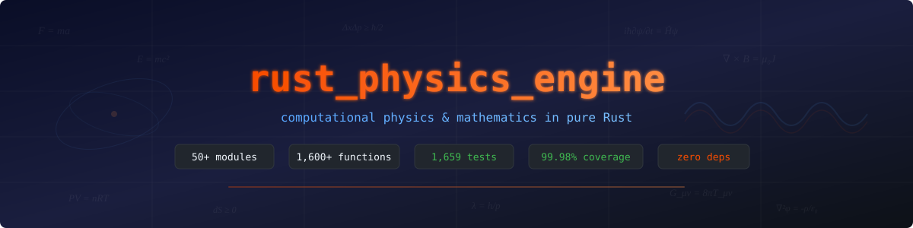

<p align="center">
  
</p>

<p align="center">
  <a href="https://github.com/Magic-Man-us/RustPhysicsEngine/actions/workflows/ci.yml"></a>
  <a href="https://github.com/Magic-Man-us/RustPhysicsEngine/actions/workflows/verify.yml"></a>
  <a href="https://github.com/Magic-Man-us/RustPhysicsEngine/actions/workflows/ci.yml"></a>
  <a href="https://github.com/Magic-Man-us/RustPhysicsEngine/actions/workflows/ci.yml"></a>
  <a href="https://github.com/Magic-Man-us/RustPhysicsEngine/actions/workflows/verify.yml"></a>
  <a href="LICENSE"></a>
  <a href="https://www.rust-lang.org/"></a>
  <a href="https://github.com/Magic-Man-us/RustPhysicsEngine"></a>
</p>

A zero-dependency Rust library for physics, mathematics and engineering computation.

The aim is not breadth for its own sake. Every routine here is written so that
something about it can be *checked* — against a closed form, against a
conservation law, against an independent implementation of the same quantity, or
against an exact identity over integers. A test that only asserts a function ran
is not evidence, and the test suite is built around that distinction. Where a
result is approximate the error has a stated bound; where it is exact the
assertion uses `==`.

---

## At a glance

| | |
|---|---|
| **Public functions and methods** | 6,365 (3,949 free functions, 2,416 methods) |
| **Public types** | 429 structs, enums and traits |
| **Top-level modules** | 71, across 296 source files |
| **Source** | 265,190 lines of Rust |
| **Unit tests** | 4,193 |
| **Property tests** | 577, across 49 files |
| **Line coverage** | 97.89% (174,685 lines, 3,681 uncovered) |
| **Function coverage** | 99.33% (20,200 functions, 136 uncovered) |
| **Formal verification** | 20 Kani harnesses (13 in CI, 7 behind `kani-slow`) |
| **Undefined behaviour** | Miri-clean; the crate contains no `unsafe` |
| **Dependencies** | none — `Cargo.lock` holds exactly one package |
| **Edition** | 2021, `f64` throughout |

---

## Install

```toml
[dependencies]
rust_physics_engine = { git = "https://github.com/Magic-Man-us/RustPhysicsEngine" }
```

## Quick start

This snippet is [`examples/readme_quickstart.rs`](examples/readme_quickstart.rs),
compiled and run by CI, so it cannot drift out of date.

```rust
use rust_physics_engine::classical::projectile_range;
use rust_physics_engine::exact::rational::Rational;
use rust_physics_engine::math::constants::{C, G};
use rust_physics_engine::units::quantity::{Dim, Quantity};

// Ballistics: v₀ = 50 m/s, θ = 45°, g = 9.81 m/s²
let range = projectile_range(50.0, std::f64::consts::FRAC_PI_4, 9.81);
assert!((range - 254.841_997_961).abs() < 1e-9);

// Constants come from one table. A black hole's Schwarzschild radius:
let solar_mass = 1.989e30;
let r_s = 2.0 * G * solar_mass / (C * C);        // about 2.95 km

// Quantities carry their dimensions, and addition checks them.
let v = Quantity::new(3.0, Dim::new(1, 0, -1, 0, 0, 0, 0)); // m/s
let t = Quantity::new(2.0, Dim::TIME);
let d = v.mul(&t).unwrap();                      // 6 m — a length, exactly
assert!(v.add(&t).is_err());                     // a velocity is not a time

// Exact rational arithmetic over arbitrary-precision integers.
let third = Rational::from_i64(1, 3);
let one = third.mul(&Rational::from_i64(3, 1));
assert_eq!(one, Rational::one());                // not 0.9999999999999999
```

---

# What's in it

Equations below are the ones the code actually implements, not a
representative sample of the field.

## Numerical foundations

**`core`** — the primitives everything else is allowed to rely on.

- **`core::dual`** — forward-mode automatic differentiation. A dual number
  `a + bε` with `ε² = 0` carries a value and its derivative through every
  operation, so `f(x + ε)` returns `f(x) + f′(x)ε` with no step size and no
  truncation error.
- **`core::interval`** — rigorous interval arithmetic with outward rounding.
  Every operation returns an interval *guaranteed* to contain the true result.
- **`core::compensated`** — Kahan and Neumaier summation, and error-free
  transformations (`two_sum`, `two_product`) that return a sum together with
  its exact rounding error.

```
dual:      (a + bε)(c + dε) = ac + (ad + bc)ε          since ε² = 0
interval:  [a,b] · [c,d] = [min(ac,ad,bc,bd), max(ac,ad,bc,bd)]
two_sum:   s = fl(a+b),  e = (a − (s − b)) + (b − (s − b)),  a + b = s + e exactly
```

**`math`** — the `Vec3` type and its algebra, and `math::constants`: the
single table of physical constants the rest of the crate refers back to.

**`linalg`** — dense `Matrix`, LU with partial pivoting, Cholesky, QR by
Householder reflections, SVD by one-sided Jacobi, eigenvalue solvers,
tridiagonal (Thomas) solve, and CSR sparse matrices with conjugate gradient.

**`numerical`** — quadrature (Simpson, Gauss–Legendre, adaptive, Romberg),
root finding (bisection, Newton, secant, Brent, polynomial roots), ODE
integrators (explicit RK, Dormand–Prince 5(4) adaptive, backward Euler and
BDF2 for stiff problems, symplectic for `x″ = a(x)`), interpolation and cubic
splines, and two-point boundary value problems.

**`special`** — error function family, gamma family, beta and regularized
incomplete beta, Bessel functions of integer order, elliptic integrals,
exponential integrals, Legendre polynomials, associated Legendre functions and
real spherical harmonics.

## Exact and symbolic computation

**`exact`** — arithmetic without rounding.

- **`bigint`** — arbitrary-precision signed integers, with Knuth's algorithm D
  for division (including the rare add-back correction).
- **`rational`** — exact rationals over `BigInt`, always reduced with a
  positive denominator. `from_f64_exact` gives the dyadic rational an `f64`
  genuinely is.
- **`bigfloat`** — arbitrary-precision binary floating point.
- **`polynomial`** — dense univariate polynomials over `f64` and over
  `Rational`.
- **`contfrac`** — continued fraction expansions, convergents, and the
  periodic expansion of a quadratic irrational.
- **`symbolic`** — a small computer algebra system over expression trees:
  a precedence-climbing parser, `Display` and LaTeX output, exact
  differentiation, simplification and expansion, Taylor series, a stack-machine
  compiler, table-driven integration, limits, gradients and Hessians.

```
Knuth D add-back:  when the trial quotient digit q̂ overshoots, the partial
                   remainder goes negative and one addition of the divisor
                   corrects it — a branch taken for roughly 2 divisions in 10⁹
```

## Discrete mathematics

**`discrete`**

- **`primes`** — three cross-checking sieves, deterministic Miller–Rabin over
  `u64`, Baillie–PSW for `BigInt`, Pollard rho and p−1, Fermat, factorization,
  and prime counting by the Lucy_Hedgehog recurrence.
- **`number_theory`** — CRT for general moduli, multiplicative functions,
  primitive roots, discrete logarithms, Legendre and Jacobi symbols,
  Tonelli–Shanks, Carmichael numbers, Gaussian integers, Frobenius,
  Egyptian fractions, Zeckendorf representations, Diophantine solving.
- **`combinatorics`** — counting, enumeration, and the permutation group.
- **`partitions`** — integer partitions, Young diagrams, RSK correspondence.
- **`sequences`** — integer sequences, linear recurrences, generating
  functions, Berlekamp–Massey.
- **`disjoint_set`** — union-find with path compression and union by size.

```
π(n)  via  φ(x, a) = φ(x, a−1) − φ(x/pₐ, a−1)      O(√n) state
          π(10⁹) = 50,847,534, computed in 87 ms in a debug build

Baillie–PSW = strong Miller–Rabin base 2  ∧  strong Lucas (Selfridge params)
          neither test's pseudoprimes below 20,000 are the other's
```

**`graph`** — `Graph` representation, structural queries, generators and
products; shortest paths (Dijkstra, Bellman–Ford, Floyd–Warshall, A*, Johnson),
spanning trees and tours; network flow (Dinic, push–relabel, min-cost flow) and
the problems that reduce to it; matchings (bipartite, general Blossom,
weighted, stable); spectral graph theory (Laplacians, centralities, effective
resistance); colouring, cliques, independent sets and covers; and force-directed
and spectral layout.

```
max-flow = min-cut
Laplacian  L = D − A,   eigenvalue 0 multiplicity = number of components
Cheeger:   λ₂/2 ≤ h(G) ≤ √(2λ₂)
effective resistance  R(u,v) = (eᵤ − eᵥ)ᵀ L⁺ (eᵤ − eᵥ)
```

**`codes`** — checksums and check digits (CRC, Luhn, Verhoeff, Damm, Fletcher,
Adler); binary linear block codes (Hamming, Golay, syndrome decoding);
Reed–Solomon and BCH over finite fields; convolutional and turbo codes with
Viterbi and BCJR, over BSC/AWGN channels; lossless compression (Huffman,
arithmetic coding, LZ77/LZW, BWT, move-to-front); and the arithmetic behind
public-key cryptography (modular exponentiation, RSA, Diffie–Hellman, elliptic
curves over prime fields, Shamir secret sharing) — for study, not for
production use.

```
Singleton bound:   d ≤ n − k + 1,  met with equality by Reed–Solomon (MDS)
Hamming bound:     2ᵏ · Σ_{i≤t} C(n,i) ≤ 2ⁿ
Shannon capacity:  C = 1 − H₂(p)  (BSC),   C = ½log₂(1 + S/N)  (AWGN)
```

## Classical and continuum mechanics

**`classical`** — projectile motion, collisions, simple harmonic motion,
damping, resonance.
**`gravitation`** — Newtonian gravity, potential, escape and orbital velocity.
**`solid_mechanics`** — stress, strain, elastic moduli, beam deflection,
Mohr's circle.
**`continuum_mechanics`** — 3-D Hooke's law, compliance matrices, plane stress
and plane strain.
**`fluid_instabilities`** — Rayleigh–Taylor, Kelvin–Helmholtz, Jeans,
Plateau–Rayleigh.
**`geophysics`** — seismic and Earth-structure relations.

```
projectile range     R = v₀² sin(2θ) / g
damped SHM           m x″ + c x′ + k x = F(t),   ζ = c / (2√(km))
Hooke (3-D)          σᵢⱼ = λ δᵢⱼ ε_kk + 2μ εᵢⱼ
Euler–Bernoulli      EI · d⁴w/dx⁴ = q(x)
Jeans length         λ_J = √(π c_s² / (G ρ))
```

**`resonance`** — the damped oscillator in closed form and numerically;
coupled oscillators, normal modes and modal superposition; acoustic and
electrical cavities (RLC, Helmholtz); nonlinear resonance (Duffing, van der
Pol); and structural dynamics with finite-element bars and beams.

## Thermodynamics and statistical mechanics

**`thermodynamics`** — ideal gas, Carnot, entropy, heat conduction, radiation,
Nusselt/Biot/Grashof.

**`statistical_mechanics`** — Maxwell–Boltzmann, Boltzmann/Einstein/Debye
models, diffusion and partition functions, plus:

- **`ising`** — the Ising model and its relatives by Monte Carlo
  (Metropolis, Wolff cluster, heat bath).
- **`lattice_models`** — percolation, random walks, growth models, avalanches.
- **`md`** — molecular dynamics: pair potentials, cell-list force evaluation,
  thermostats, radial distribution functions.
- **`kinetics`** — chemical kinetics: rate laws, deterministic and stochastic
  reaction networks (Gillespie), Michaelis–Menten, Eyring, Nernst.

```
partition function   Z = Σ exp(−βEᵢ),   ⟨E⟩ = −∂ln Z/∂β,   F = −kT ln Z
Ising energy         E = −J Σ⟨ij⟩ sᵢsⱼ − h Σᵢ sᵢ
Onsager (2-D)        sinh(2J/kT_c) = 1  ⟹  kT_c/J = 2/ln(1+√2) ≈ 2.269
Lennard-Jones        V(r) = 4ε[(σ/r)¹² − (σ/r)⁶]
Arrhenius            k = A exp(−Eₐ/RT)
Nernst               E = E° − (RT/zF) ln Q
```

## Electromagnetism and electronics

**`electromagnetism`** — Coulomb, Lorentz, Faraday, Maxwell, RLC circuits,
transformers.
**`electronics`** — semiconductors, diodes, MOSFETs, solar cells, PN junctions.
**`rf`** — Friis, skin depth, antenna gain, impedance, VSWR, Smith chart
quantities.
**`photonics`** — Gaussian beams, fibre optics, ray transfer matrices,
coherence, Fabry–Pérot.
**`plasma`** — Debye length, cyclotron and plasma frequencies, Alfvén speed,
beta, Larmor radius.
**`magnetohydrodynamics`** — Alfvén waves, Hartmann flow, magnetic
reconnection, pinch equilibria.

```
Maxwell        ∇·E = ρ/ε₀   ∇·B = 0   ∇×E = −∂B/∂t   ∇×B = μ₀J + μ₀ε₀ ∂E/∂t
Lorentz        F = q(E + v × B)
skin depth     δ = √(2ρ / (ωμ))
Friis          P_r/P_t = G_t G_r (λ / 4πR)²
plasma freq    ω_p = √(n e² / (ε₀ mₑ))
Alfvén         v_A = B / √(μ₀ ρ)
```

## Waves, optics and acoustics

**`waves`** — Doppler, standing waves, diffraction, Snell, seismic waves,
dispersion.
**`optics`** — lenses, mirrors, thin films, diffraction gratings, Rayleigh
resolution.
**`acoustics`** — Sabine and Eyring reverberation, psychoacoustic scales (mel,
bark, ERB), room modes, STC.

```
Snell            n₁ sin θ₁ = n₂ sin θ₂
thin lens        1/f = 1/dₒ + 1/dᵢ
Rayleigh         θ = 1.22 λ/D
Sabine           RT₆₀ = 0.161 V / A
mel              m = 2595 log₁₀(1 + f/700)
```

## Signal processing and transforms

**`transforms`**

- **`fft`** — fast Fourier transforms at *any* length: radix-2 and mixed-radix
  for composite sizes, Bluestein's chirp-z for prime ones.
- **`dct`** — discrete cosine, sine and Hartley transforms.
- **`stft`** — short-time Fourier transform, spectrograms, Goertzel, chirp-z.
- **`wavelet`** — discrete and continuous wavelet transforms, with canonical
  orthogonal and biorthogonal scaling-filter tables (Daubechies, Symlet,
  Coiflet, Biorthogonal).
- **`hilbert`** — Hilbert transform, analytic signals, modulation, empirical
  mode decomposition.
- **`laplace`** — numerical inverse Laplace transforms (fixed-Talbot,
  Gaver–Stehfest).
- **`radon`** — Radon transform and filtered back-projection, plus Hankel and
  Abel transforms.
- **`spectral`** — periodogram, Welch averaging, multitaper (DPSS), Lomb–Scargle
  for unevenly sampled data.

**`dsp`** — window functions; FIR design (windowed-sinc, Parks–McClellan,
least-squares) and application; IIR filters (RBJ biquads, second-order-section
cascades, Butterworth/Chebyshev/elliptic); sample-rate conversion (integer,
polyphase rational, arbitrary); and phase tools (1-D and Itoh 2-D unwrapping,
phase-locked loops).

**`signal_processing`** — waveform generation, convolution, correlation.

```
DFT              X[k] = Σₙ x[n] e^(−2πikn/N)
Parseval         Σ|x[n]|² = (1/N) Σ|X[k]|²
Bluestein        X[k] = conj(chirp) · ( (x·chirp) ⊛ chirp )    any N
biquad (RBJ)     H(z) = (b₀ + b₁z⁻¹ + b₂z⁻²) / (a₀ + a₁z⁻¹ + a₂z⁻²)
Lomb–Scargle     periodogram for non-uniform sampling, exact for a pure tone
```

## Audio

**`audio`** — PolyBLEP anti-aliased oscillators and test signals; envelopes,
LFOs, followers and glides; additive, FM (DX7-style operator routing), granular
and wavetable synthesis; physical modelling (digital waveguides for plucked,
struck and bowed strings, modal resonators); effects (delays, Schroeder and
Freeverb reverbs, feedback delay networks, chorus, distortion, dynamics);
analysis (YIN, autocorrelation, cepstral and HPS pitch detection, onset
detection, MFCC); a phase vocoder for time stretching and pitch shifting;
musical tuning (temperaments, interval arithmetic, Scala file parsing); spatial
audio (panning laws, VBAP, ambisonics, binaural cues); and WAV (RIFF) reading
and writing for PCM 8/16/24/32-bit and IEEE float.

```
PolyBLEP     corrects the discontinuity at a hard edge by subtracting a
             polynomial approximation to the band-limited step
YIN          d′(τ) = d(τ) / [(1/τ) Σ_{j≤τ} d(j)]   cumulative mean normalization
equal temp   fₙ = f₀ · 2^(n/12);  cents = 1200 log₂(f₂/f₁)
```

## Fluids and computational fluid dynamics

**`fluids`** — Bernoulli, Poiseuille, Reynolds, drag, capillarity, compressible
flow.
**`propulsion`** — Tsiolkovsky, Hohmann transfers, nozzle design, staging.

**`cfd`** — staggered (MAC) grids and cell-centred scalar fields; advection
schemes (upwind, Lax–Wendroff, QUICK, MUSCL, WENO); a stable-fluids
incompressible solver with MacCormack advection and pressure projection; exact
and approximate Riemann solvers for the compressible Euler equations (HLL,
HLLC, Roe); well-balanced shallow water; smoothed-particle hydrodynamics;
lattice Boltzmann (D2Q9 with BGK/TRT/MRT collision); level sets for interface
capturing with WENO advection and Sussman reinitialization; potential flow with
complex-variable methods; Blasius and Falkner–Skan boundary layers; turbulence
modelling and statistics; regularized Biot–Savart vortex methods in 2-D and
3-D; Darcy and unsaturated porous-media flow; and multiphase drift-flux
correlations.

```
Navier–Stokes    ∂u/∂t + (u·∇)u = −∇p/ρ + ν∇²u + f,    ∇·u = 0
Reynolds         Re = ρUL/μ
Bernoulli        p + ½ρv² + ρgh = const
Euler (1-D)      ∂/∂t[ρ, ρu, E] + ∂/∂x[ρu, ρu²+p, u(E+p)] = 0
CFL              Δt ≤ CFL · Δx / max|λ|
lattice Boltzmann  fᵢ(x+cᵢΔt, t+Δt) − fᵢ(x,t) = −(1/τ)(fᵢ − fᵢ^eq)
Blasius          2f‴ + f f″ = 0,  δ/x = 5.0/√Re_x,  c_f = 0.664/√Re_x
```

## Relativity, quantum and particle physics

**`relativity`** — Lorentz transformations, relativistic energy–momentum, time
dilation, Doppler.
**`general_relativity`** — Schwarzschild metric, geodesics, frame dragging,
cosmological distances.
**`particle_physics`** — invariant mass, Rutherford scattering, Breit–Wigner,
rapidity, Lorentz boosts.

**`quantum`** — de Broglie, uncertainty, particle in a box, tunnelling, Planck
radiation, plus:

- **`wavefunction`** — 1-D wavefunctions, the standard eigenstates, and
  phase-space representations (Wigner, Husimi).
- **`schrodinger`** — stationary and time-dependent solvers: shooting,
  Numerov, matrix diagonalization, split-operator and Crank–Nicolson
  propagation.
- **`circuit`** — a state-vector quantum circuit simulator, with density
  matrices and noise channels.
- **`algorithms`** — Deutsch–Jozsa, Grover, quantum Fourier transform, phase
  estimation, Shor's order finding.
- **`spin`** — spin operators, quantum magnets, magnetic resonance.
- **`solid_state`** — bands, densities of states, transport, phonons.

```
Schrödinger     iħ ∂ψ/∂t = −(ħ²/2m)∇²ψ + Vψ
box eigenvalues Eₙ = n²π²ħ²/(2mL²)
uncertainty     Δx Δp ≥ ħ/2
Schwarzschild   ds² = −(1−r_s/r)c²dt² + (1−r_s/r)⁻¹dr² + r²dΩ²,  r_s = 2GM/c²
invariant mass  m²c⁴ = E² − (pc)²
Grover          ~ (π/4)√N iterations
```

## Nuclear and radiation

**`nuclear`** — decay chains, binding energy, Q-values, dosimetry.
**`neutronics`** — criticality, diffusion, moderation, burnup, shielding.
**`radiation`** — blackbody, Wien, Planck, radiative transfer, view factors.

```
decay           N(t) = N₀ e^(−λt),  t½ = ln2/λ
semi-empirical  B = aᵥA − a_sA^(2/3) − a_c Z²/A^(1/3) − a_a(A−2Z)²/A ± δ
four-factor     k_∞ = η f p ε
Planck          B(λ,T) = (2hc²/λ⁵) / (exp(hc/λkT) − 1)
Wien            λ_max T = 2.897771955×10⁻³ m·K
Stefan–Boltzmann  j = σT⁴,  σ = 2π⁵k⁴/(15h³c²)
```

## Astrophysics and orbital mechanics

**`astrophysics`** — N-body simulation with a leapfrog integrator; Barnes–Hut
octree for O(N log N) forces; Keplerian elements from state vectors and orbit
propagation; gravitational-wave strain, luminosity, frequency and chirp mass;
tidal forces, Roche limits and tidal tensors; L1–L5 Lagrange points; habitable
zone boundaries and tidal locking; dipole magnetospheres and field-line
tracing; impact cratering and collision probabilities; plus:

- **`kepler`** — Kepler's equation solved to a residual below 1e-12 including
  e = 0.99, for elliptic, parabolic and hyperbolic orbits.
- **`maneuvers`** — Hohmann and bi-elliptic transfers, plane changes, phasing,
  J2 secular rates.
- **`lambert`** — Lambert's problem: the transfer orbit between two positions
  in a given time.
- **`time_systems`** — Julian dates, UT1/TAI/TT/TDB, sidereal time, ΔT.
- **`coords`** — equatorial, ecliptic, galactic, horizontal and ITRF frames,
  precession and nutation.

```
Kepler           M = E − e sin E          (elliptic)
                 M = e sinh H − H         (hyperbolic)
vis-viva         v² = μ(2/r − 1/a)
Hohmann          Δv₁ = √(μ/r₁)(√(2r₂/(r₁+r₂)) − 1)
J2 nodal drift   Ω̇ = −(3/2) J₂ (R/p)² n cos i     sun-synchronous at 700 km: i = 98.2°
chirp mass       ℳ = (m₁m₂)^(3/5) / (m₁+m₂)^(1/5)
Roche limit      d = 2.44 R (ρ_M/ρ_m)^(1/3)
J2000            JD of 2000-01-01 12:00 TT = 2451545.0
```

## PDE solvers: finite elements, FDTD and spectral

**`fem`** — three ways of turning a differential equation into a linear system,
kept together because the interesting content is how they differ.

- **`fem1d`** — one-dimensional finite elements for `−(p u′)′ + q u = f`, with
  P1 and P2 elements, Dirichlet/Neumann/Robin boundary conditions, and L², H¹
  and energy-norm error computation.
- **`fem2d`** — triangular elements in the plane: Poisson, reaction–diffusion,
  Helmholtz, drum eigenvalues and eigenmodes, plane-stress elasticity with
  strain, stress and von Mises recovery, and transient heat.
- **`fdtd`** — Maxwell's equations on a Yee grid: 1-D and 2-D TM, Berenger
  split-field PML with polynomial grading, Mur absorbing boundaries, photonic
  crystal band gaps, and waveguide cutoff.
- **`spectral_pde`** — Chebyshev differentiation matrices and collocation
  BVPs, Fourier spectral solvers for periodic problems.

The finite element method is the one that gives an *optimality* statement
rather than an error estimate. Galerkin orthogonality makes the discrete
solution the exact energy-norm projection of the true one, so the error obeys a
Pythagoras identity — an equality, which cannot hold by accident:

```
Galerkin           a(u − u_h, v_h) = 0  for every v_h in the space
Pythagoras         ‖u − v_h‖²_a = ‖u − u_h‖²_a + ‖u_h − v_h‖²_a
convergence        P1: O(h²) in L², O(h) in H¹;   P2: O(h³) in L², O(h²) in H¹
cotangent          K_ij = −½(cot α + cot β)      Delaunay ⟹ M-matrix
Rayleigh–Ritz      discrete eigenvalues bound the true ones from above

FDTD (1-D)         E^(n+1) = E^n − (Δt/εΔx)(H^(n+½)_{i+½} − H^(n+½)_{i−½})
leapfrog energy    U^n = ½Σ εᵣ(E^n)² + ½Σ H^(n−½)H^(n+½)     conserved exactly
Courant            S = cΔt/Δx ≤ 1/√d,  set by the *fastest* medium (min εᵣ)
magic time step    S = 1 in 1-D is an exact shift — zero dispersion error
PML grading        σ_max = −(m+1) S ln(R₀) / (2D)
waveguide cutoff   ω_c = (2/S) arcsin(S sin(k_y/2))   below mπ/a by (k_y/2)²(1−S²)/6

Chebyshev          exact on polynomials up to degree N; the diagonal of the
                   differentiation matrix follows from the negative sum trick
```

## Chemistry and biophysics

**`chemistry`** — Arrhenius, Nernst, pH, electrochemistry, reaction kinetics.

**`biophysics`** — Nernst and Goldman potentials, Michaelis–Menten, Hill
equation, hemodynamics, plus:

- **`epidemiology`** — SIR/SEIR/SIRS compartment models, their stochastic
  counterparts, and the final-size relation.
- **`population`** — growth laws, Lotka–Volterra and competition models,
  Hardy–Weinberg, drift, selection and coalescent theory.
- **`seq_align`** — Needleman–Wunsch, Smith–Waterman, affine gaps
  (Gotoh), and elementary sequence analysis.
- **`phylo`** — distance methods (UPGMA, neighbour joining), character methods
  (Fitch, Sankoff), and substitution models (Jukes–Cantor, Kimura).
- **`neuro`** — Hodgkin–Huxley, integrate-and-fire variants, spike trains,
  synapses and small networks.

```
Michaelis–Menten   v = V_max[S] / (K_m + [S])
Hill               θ = [L]ⁿ / (K_d + [L]ⁿ)
Goldman            V_m = (RT/F) ln[ (P_K[K]ₒ + P_Na[Na]ₒ + P_Cl[Cl]ᵢ)
                                  / (P_K[K]ᵢ + P_Na[Na]ᵢ + P_Cl[Cl]ₒ) ]
SIR                S′ = −βSI,  I′ = βSI − γI,  R′ = γI,   R₀ = β/γ
final size         ln(S₀/S_∞) = R₀(1 − S_∞/N)
Hodgkin–Huxley     C dV/dt = −ḡ_Na m³h(V−E_Na) − ḡ_K n⁴(V−E_K) − g_L(V−E_L) + I
Jukes–Cantor       d = −(3/4) ln(1 − (4/3)p)
```

## Stochastic processes and time series

**`stochastic`**

- **`markov`** — finite Markov chains, stationary distributions, absorption,
  and Markov chain Monte Carlo.
- **`hmm`** — hidden Markov models: forward–backward, Viterbi, Baum–Welch,
  and particle filters.
- **`sde`** — stochastic differential equations: Euler–Maruyama, Milstein,
  strong and weak convergence, geometric Brownian motion,
  Ornstein–Uhlenbeck, fractional Brownian motion.
- **`point_process`** — Poisson, inhomogeneous, Hawkes and Cox processes.
- **`queueing`** — birth–death queues, Erlang B and C, networks.
- **`timeseries`** — autocorrelation, stationarity tests, ARMA fitting,
  spectral estimation, Kalman filtering.
- **`rmt`** — random matrix theory: the classical ensembles, semicircle and
  Marchenko–Pastur laws, level spacing.
- **`extreme`** — extreme value theory (GEV, GPD, block maxima, peaks over
  threshold) and copulas.

```
Chapman–Kolmogorov  P^(m+n) = P^m P^n
detailed balance    π(i)P(i,j) = π(j)P(j,i)  ⟹  π stationary
Itô                 dX = a(X,t)dt + b(X,t)dW
Euler–Maruyama      strong order ½, weak order 1
Milstein            strong order 1
Little's law        L = λW
Erlang B            B(c,a) = (aᶜ/c!) / Σ_{k≤c} (aᵏ/k!)
semicircle          ρ(x) = (1/2π)√(4 − x²)  on [−2, 2]
Marchenko–Pastur    support [(1−√λ)², (1+√λ)²],   λ = p/n
```

## Optimization and operations research

**`optimization`**

- **`lp`** — the simplex method, interior point methods, duality and
  sensitivity analysis.
- **`integer`** — branch and bound, cutting planes, dynamic programming,
  knapsack, TSP, combinatorial search.
- **`network`** — project planning (CPM/PERT), flows on networks, scheduling.
- **`convex`** — gradient and accelerated gradient methods, L-BFGS, proximal
  operators, ADMM, projections.
- **`metaheuristics`** — simulated annealing, genetic algorithms, particle
  swarm, differential evolution, CMA-ES, Bayesian optimization, and the
  standard benchmark functions.
- **`game_theory`** — Nash and correlated equilibria, evolutionary dynamics,
  Shapley value, the core, auctions and matching.
- **`least_squares`** — Levenberg–Marquardt for nonlinear least squares.

Plus golden section, Brent, Nelder–Mead, linear regression and polynomial
fitting at the module root.

```
LP duality        max cᵀx s.t. Ax ≤ b, x ≥ 0   ≡   min bᵀy s.t. Aᵀy ≥ c, y ≥ 0
complementary     xⱼ(Aᵀy − c)ⱼ = 0  and  yᵢ(b − Ax)ᵢ = 0  at optimality
KKT               ∇f + Σλᵢ∇gᵢ + Σμⱼ∇hⱼ = 0,  λᵢgᵢ = 0,  λᵢ ≥ 0
Nesterov          O(1/k²) for smooth convex, against O(1/k) for plain descent
Shapley           φᵢ = Σ_S |S|!(n−|S|−1)!/n! · [v(S∪{i}) − v(S)]
```

## Machine learning

**`learn`** — written to be read rather than to be fast, and every method has
an exactly checkable property attached, because that is what makes a learning
algorithm testable at all.

- **`nn`** — feed-forward networks trained by backpropagation, with a
  numerical gradient check as the definitive test, plus 2-D convolution.
- **`gp`** — Gaussian process regression: fitting, prediction, log marginal
  likelihood, hyperparameter optimization, posterior sampling.
- **`cluster`** — k-means with k-means++ initialization and restarts, DBSCAN,
  hierarchical agglomerative clustering, Gaussian mixture EM, silhouette,
  adjusted Rand index, Davies–Bouldin, and k-nearest-neighbour
  classification and regression.
- **`tree`** — decision trees, regression trees, feature importance, random
  forests, gradient boosting.

```
backprop          reverse-mode differentiation — so a finite-difference check
                  settles whether the gradients are right, and nothing else does
softmax + CE      ∂L/∂z = p − y   exactly, at the logits
GP posterior      μ* = K*ᵀ(K + σ²I)⁻¹y,   Σ* = K** − K*ᵀ(K + σ²I)⁻¹K*
log marginal      log p(y) = −½yᵀK⁻¹y − ½log|K| − (n/2)log 2π
k-means           Lloyd's algorithm decreases inertia monotonically
EM                increases the log likelihood monotonically
tree depth d      ⟹ at most 2^d leaves ⟹ at most 2^d distinct predictions
ARI               corrected for chance: expected value 0 for a random labelling
```

## Quantitative finance

**`finance`**

- **`options`** — Black–Scholes closed forms and Greeks, binomial and
  trinomial lattices, Monte Carlo with variance reduction, Longstaff–Schwartz
  for American options, and a Crank–Nicolson PDE solver.
- **`rates`** — discounting, bond pricing, duration and convexity, curve
  bootstrapping, and short-rate models (Vasicek, CIR, Hull–White).
- **`portfolio`** — mean–variance optimization, the efficient frontier,
  CAPM, and performance measurement.
- **`risk`** — value at risk, expected shortfall, and backtesting.

```
Black–Scholes    C = S N(d₁) − K e^(−rT) N(d₂)
                 d₁ = [ln(S/K) + (r + σ²/2)T] / (σ√T),   d₂ = d₁ − σ√T
put–call parity  C − P = S − K e^(−rT)      holds to 1e-12
binomial → BS    error O(1/n)
Macaulay duration  D = Σ t·CF_t·e^(−rt) / P,    ΔP/P ≈ −D·Δy
Vasicek          dr = a(b − r)dt + σdW
VaR / ES         ES_α = E[X | X ≤ VaR_α]  — coherent where VaR is not
```

## Geometry, manifolds and topology

**`geometry`** — areas, volumes, perimeters, regular polygons.
**`curves`** — conic sections, Bézier curves, arc length, curvature.
**`trigonometry`** — identities, hyperbolic functions, angle conversion,
haversine.
**`quaternion`** — quaternion algebra, slerp and nlerp, axis–angle, Euler
conversions.
**`vector_calculus`** — gradient, divergence, curl, Laplacian, a Poisson
solver, and line, surface and volume integrals.

**`manifold`** — geometry beyond three dimensions.

- **`vecn`** — n-dimensional vectors and arbitrary-rank tensors.
- **`metric`** — Riemannian metrics, Christoffel symbols, curvature tensors.
- **`geodesic`** — geodesics, parallel transport, Jacobi fields, relativistic
  orbits.
- **`lie`** — Lie groups and algebras: rotation and rigid-motion groups in 2,
  3 and 4 dimensions, exponential and logarithm maps.
- **`hyperbolic`** — the Poincaré disk and ball, upper half-space, hyperboloid
  and Klein models, and the maps between them.
- **`spherical`** — n-sphere maps, spherical trigonometry, map projections.
- **`polytope4`** — the six regular 4-polytopes with their full symmetry
  groups, Schlegel diagrams and cross sections.
- **`clifford`** — Clifford (geometric) algebras Cl(p, q, r) with a dense
  multivector type.
- **`dec`** — discrete exterior calculus on triangle meshes.
- **`embedding`** — manifold learning: spectral embeddings, MDS, Isomap, LLE,
  diffusion maps.
- **`spacetime`** — four-vectors, Lorentz transforms, and curved-spacetime
  metrics.

```
Christoffel       Γᵏᵢⱼ = ½gᵏˡ(∂ᵢgⱼˡ + ∂ⱼgᵢˡ − ∂ˡgᵢⱼ)
geodesic          ẍᵏ + Γᵏᵢⱼ ẋⁱẋʲ = 0
Riemann           R^ρ_σμν = ∂_μΓ^ρ_νσ − ∂_νΓ^ρ_μσ + Γ^ρ_μλΓ^λ_νσ − Γ^ρ_νλΓ^λ_μσ
Gauss–Bonnet      ∫K dA + ∮k_g ds = 2πχ
geometric product ab = a·b + a∧b
hyperbolic area   for a triangle,  A = π − (α + β + γ)
Euler characteristic  V − E + F = 2 for every convex polyhedron
```

**`spatial`** — bounding volume hierarchies, k-d trees, quadtrees and octrees;
orientation predicates and containment tests; closest-point and set-distance
queries; intersection tests; rigid coordinate frames; 4×4 homogeneous
transforms and 2-D affine transforms; 2-D projective geometry with cross
ratios; and signed distance fields with primitives, combinators and domain
operators.

**`mesh`** — indexed triangle meshes: construction, mass properties, cleanup,
topology analysis (manifoldness, orientation, boundary, genus), procedural
generation with watertight closed shapes, subdivision surfaces (Loop,
Catmull–Clark, √3, midpoint), parameterization, isosurface and isocontour
extraction, and parametric surfaces (Bézier, B-spline, NURBS).

## Patterns, fractals and chaos

**`fractals`** — escape-time fractals with smooth colouring (Mandelbrot, Julia,
burning ship, Newton); strange attractors (Lorenz, Rössler, and 2-D chaotic
maps); iterated function systems and the chaos game; Lindenmayer systems;
cellular automata and growth models; and coherent noise (Perlin, OpenSimplex2,
Worley, fBm).

**`patterns`** — 2-D polygon algorithms (triangulation, simplification,
offsetting, boolean operations); Poisson-disk and low-discrepancy sampling
(Bridson, Halton, Sobol); Platonic, Archimedean, Catalan, Johnson and Goldberg
polyhedra; aperiodic tilings (Penrose P2 and P3 by substitution); circle and
sphere packings (Descartes, Apollonian, lattice); phyllotaxis and spirals;
space-filling curves (Hilbert, Morton, Peano); knots and space curves with
Frenet frames; and the 17 wallpaper groups and 7 frieze groups.

**`nonlinear`** — logistic map, Lorenz and Rössler attractors, Lyapunov
exponents, bifurcation diagrams.

**`information_theory`** — Shannon entropy, mutual information, KL divergence,
channel capacity.

```
Mandelbrot       z ↦ z² + c,  escape when |z| > 2
Feigenbaum       δ = 4.669201609…,  α = 2.502907875…
Lyapunov         λ = lim (1/n) Σ ln|f′(xᵢ)|,   λ > 0 ⟹ chaos
box counting     D = lim log N(ε) / log(1/ε)
Descartes        (k₁+k₂+k₃+k₄)² = 2(k₁²+k₂²+k₃²+k₄²)
golden angle     137.507764…° = 360°/φ²
Shannon          H = −Σ pᵢ log₂ pᵢ
```

## Units, dimensions and constants

**`units`** — SI conversions for temperature, pressure, energy, length, speed,
angle and more, plus:

- **`quantity`** — `Dim`, seven signed-byte exponents for metre, kilogram,
  second, ampere, kelvin, mole and candela; and `Quantity`, a value that
  carries them. Addition checks that the exponents agree and refuses if they
  do not, multiplication adds them, and a square root fails unless every one is
  even. None of it is approximate. Also a unit parser (`"9.81 m/s^2"`,
  `"3 kWh"`), SI prefix formatting, and the 2022 CODATA constants.
- **`dimensional`** — Buckingham's Π theorem computed as an exact null space
  over `Rational`, the named dimensionless groups, natural units (ħ = c = 1),
  the Planck scale, and `dimensional_check_formula`, which walks a symbolic
  expression and refuses a sum of unlike terms or a sine of a length.

```
Buckingham        n quantities, r independent dimensions ⟹ exactly n − r groups
                  a group is exactly in the null space or it is not — so the
                  computation is done over Rational, never in floating point
Reynolds          Re = ρUL/μ  — the one group of the pipe-flow problem
Planck length     √(ħG/c³) = 1.616255×10⁻³⁵ m
Planck mass       √(ħc/G)  = 2.176434×10⁻⁸ kg
natural units     [L] = [T] = [E]⁻¹,  [M] = [E];  1 kg = 5.6096×10³⁵ eV
transcendentals   exp, sin and ln take a pure number — because their series add
                  x to x³, so exp(−t/τ) is meaningful and exp(−t) is not
```

Physical constants live in one table, `math::constants`. The values fixed by
the 2019 SI redefinition are exact; derived ones are computed from their
factors rather than transcribed, so `FARADAY == N_A * E_CHARGE` holds bit for
bit. A test pins the two constant tables together: the SI-exact constants must
agree exactly, and the measured ones to within 1e-8, which separates the
2018→2022 CODATA revision from a mistyped digit.

## Reference data

- **`materials::elements`** — all 118 elements with atomic mass, density,
  melting and boiling points, and thermal and electrical conductivity.
- **`materials::common`** — engineering materials (steels, aluminium, copper…).
- **`materials::fluids`** — 16 fluids with density, viscosity, surface tension
  and speed of sound.
- **`materials::gases`** — gases with molar mass, specific heat ratio and
  thermal conductivity.

## Simulation engines

- **`sim::rigid_body`** — 3-D rigid body dynamics with quaternion orientation,
  Euler's equations, and collision response.
- **`sim::fluid_sim`** — column fluid, 1-D shallow water, 2-D incompressible
  Euler with pressure projection.
- **`sim::heat_sim`** — 2-D and 3-D heat conduction, convection–diffusion.
- **`sim::wave_sim`** — 1-D and 2-D wave equations with Mur absorbing
  boundaries.
- **`sim::em_sim`** — 1-D and 2-D FDTD with PEC and Mur boundaries and
  dielectric media.
- **`sim::cloth_sim`** — Verlet cloth and rope with spring–damper constraints.

## Utilities

- **`color_science`** — RGB/HSV/HSL/XYZ, wavelength to colour, blackbody
  colour, CIE colour difference.
- **`control_systems`** — transfer functions, step and impulse response, PID
  tuning, stability margins.
- **`atmosphere`** — the ISA model, barometric formula, lapse rates, humidity,
  wind shear.
- **`monte_carlo`** — Monte Carlo integration, Metropolis–Hastings, Langevin
  dynamics, random walks, and an `Rng`.
- **`statistics`** — descriptive measures, error propagation, distributions,
  hypothesis tests and confidence intervals, resampling (bootstrap, BCa,
  permutation), and DFT utilities.
- **`fields`** — uniform-grid scalar fields.
- **`error`** — the error types the numerical solvers share.

> **A note on `monte_carlo::Rng`.** It is a plain linear congruential
> generator that returns its raw state, so the low bits have a short period:
> `next_u64() % m` for a power-of-two `m` cycles through a handful of values.
> Use `Rng::below(n)`, which takes the high bits, for any small-integer draw.

---

# How it's tested

Four independent mechanisms, because they fail in different ways.

### Unit tests — 4,193

Every one asserts something checkable: a closed form, a conservation law, a
known reference value, or an exact identity. Approximate results carry a stated
tolerance derived from the method's error term, not one tuned until the test
passed.

### Property tests — 577, across 49 files

Randomized tests over invariants that must hold for *every* input, not for a
chosen example. They are what catch the cases nobody thought to write down:
round-trips (transform then invert), algebraic laws (multiplying dimensions
adds their exponents, exactly), conservation (leapfrog FDTD energy), and
agreement between two independent implementations of the same quantity.

### Formal verification — 20 Kani harnesses

Kani model-checks with CBMC: for a bounded input domain it proves absence of
panics, overflow and division by zero, rather than sampling. Thirteen run in
CI; seven that CBMC cannot decide in a CI-sized budget sit behind the
`kani-slow` feature, with the measured times recorded in
`src/verification/mod.rs`. Asserting panic-freedom lands in well under a
minute; asserting a numeric relation between symbolic float expressions
exceeds five, because CBMC must bit-blast the full mantissa of every
intermediate.

### Miri

The crate contains no `unsafe`, so Miri is a backstop rather than the primary
check. It runs against `core::` — the interval and dual-number arithmetic,
where index and slice reasoning is densest — under
`-Zmiri-strict-provenance`.

### Coverage — 97.89% of lines, 99.33% of functions

Measured by `cargo llvm-cov` on every push.

### Why the coverage number is not the point

Coverage says a line ran, not that anything checked what it did. Some of the
worst gaps this project has found were in lines with full coverage:

- **The strong Lucas test** — the second half of Baillie–PSW — was replaced
  wholesale with `return true`, and the entire suite stayed green. Composites
  are rejected by Miller–Rabin first, so the Lucas branch is essentially never
  reached in practice. It is now tested directly against the strong Lucas
  pseudoprimes below 20,000 (5459, 5777, 10877, 16109, 18971), computed
  independently rather than read off the implementation.
- **Knuth's add-back correction** in `BigInt` division, taken for roughly two
  divisions in a billion.
- **The Lentz convergence threshold** in the continued-fraction evaluators.

Each was found by mutating the code and observing that no test noticed.

---

## Design

- **Zero dependencies.** `Cargo.lock` holds exactly one package: this crate.
- **`f64` throughout**, except where exactness is the point — `exact` works
  over arbitrary-precision integers and rationals, and `units::dimensional`
  computes null spaces over `Rational` because a group is exactly
  dimensionless or it is not.
- **Input validation.** Public functions validate their inputs: positive mass,
  non-zero denominators, physical bounds. Solvers return `Result` rather than
  panicking on non-convergence.
- **One table per constant.** Physical constants come from `math::constants`;
  duplicates elsewhere are re-exports, and a test enforces the agreement.
- **Documented specification choices.** Where a definition is genuinely
  ambiguous — the Frobenius number with a unit coin, Stern–Brocot indexing,
  which parenthesization a unit string means — the reading is stated in the
  doc comment rather than left implicit.

## Building and testing

```bash
cargo build                              # build
cargo test --lib                         # 4,193 unit tests
cargo test --release --test properties   # 577 property tests
cargo clippy --all-targets -- -D warnings
cargo llvm-cov --summary-only            # coverage (needs cargo-llvm-cov)
cargo kani                               # 13 harnesses (needs Kani)
cargo kani --features kani-slow          # all 20, much slower
cargo miri test --lib -- core:: --skip ::core::
```

CI runs `test` and `coverage` as parallel jobs, and a separate `verify`
workflow runs the property suite, Kani, Miri and a strict Clippy pass.

## License

MIT
